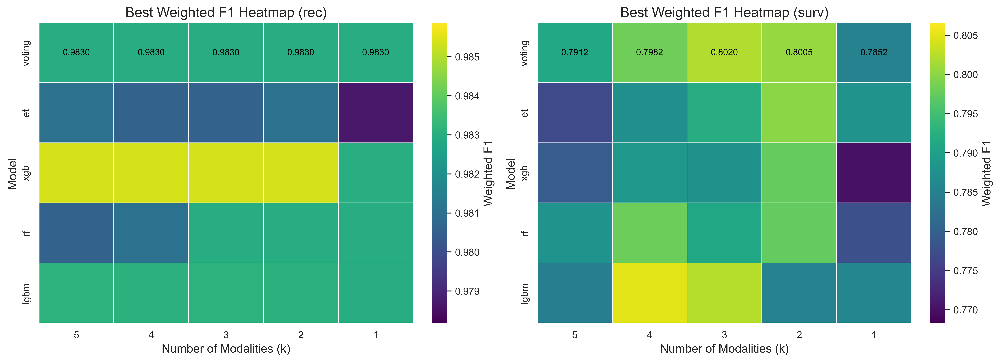
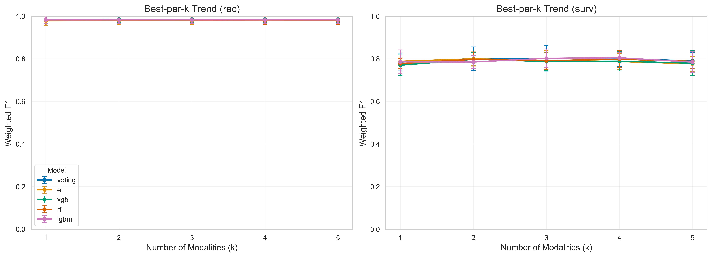
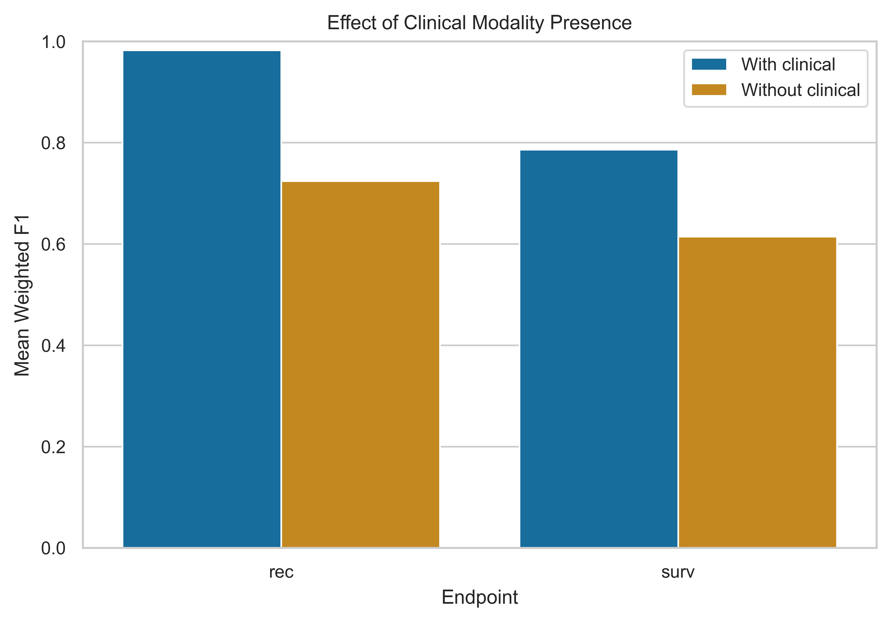
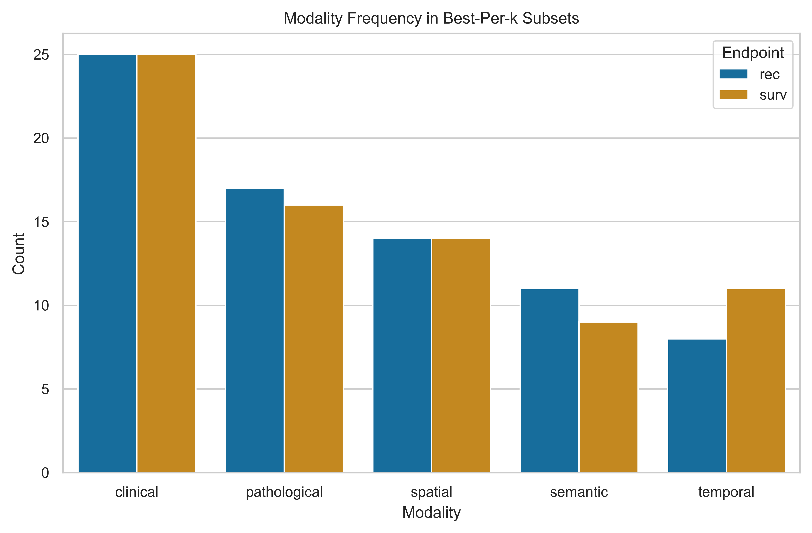
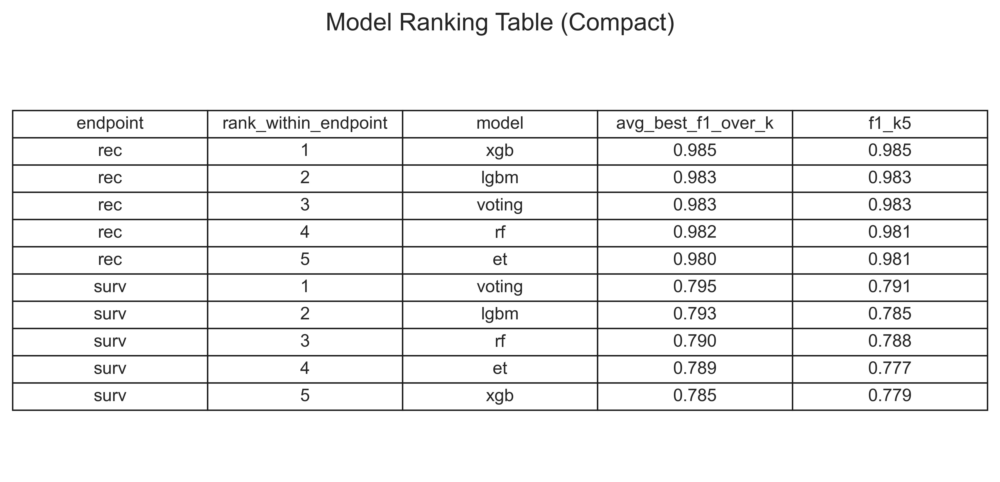

# Multimodal Representations vs Model Complexity

This section evaluates the paper claim that performance gains are driven more by shared multimodal representations than by downstream model complexity. We ran an exhaustive modality-count ablation over 5 models (`voting`, `et`, `xgb`, `rf`, `lgbm`) for both endpoints (5-year survival and 2-year recurrence), using stratified 5-fold CV and all modality combinations from `k=5` to `k=1`.

## Key Visual Evidence

### Figure 1. Best-per-k heatmap (model x modality count)

### Figure 2. Best-per-k trend with fold-level variability

### Figure 3. Clinical modality effect (with vs without clinical embeddings)

### Figure 4. Modality frequency among best subsets

### Figure 5. Compact model ranking table (image)

## Main Findings

1. Performance remains strong across model families, with no single architecture universally dominant across both endpoints.
2. Modality composition changes performance systematically; clinical-containing subsets dominate best selections.
3. In best-per-k selections, `clinical` appears in all selected subsets for both endpoints (25/25 each), supporting representation-centric interpretation.
4. Recurrence ranking favors `xgb`/`lgbm`, while survival ranking favors `voting`/`lgbm`; this endpoint-specific ordering coexists with the same modality-level pattern.

## Table A. Main Best-Per-k Results

| endpoint   | model   |    F1_k1 |    F1_k2 |    F1_k3 |    F1_k4 |    F1_k5 |   best_k | best_subset                                     |   best_f1 |
|:-----------|:--------|---------:|---------:|---------:|---------:|---------:|---------:|:------------------------------------------------|----------:|
| rec        | xgb     | 0.983012 | 0.985371 | 0.985371 | 0.985371 | 0.985371 |        5 | clinical+semantic+temporal+pathological+spatial |  0.985371 |
| rec        | lgbm    | 0.982977 | 0.983091 | 0.983126 | 0.983091 | 0.983126 |        5 | clinical+semantic+temporal+pathological+spatial |  0.983126 |
| rec        | rf      | 0.982977 | 0.982978 | 0.982978 | 0.981047 | 0.980615 |        3 | clinical+pathological+spatial                   |  0.982978 |
| rec        | voting  | 0.982977 | 0.982977 | 0.982977 | 0.982977 | 0.982977 |        5 | clinical+semantic+temporal+pathological+spatial |  0.982977 |
| rec        | et      | 0.978684 | 0.981047 | 0.980615 | 0.980615 | 0.981047 |        5 | clinical+semantic+temporal+pathological+spatial |  0.981047 |
| surv       | lgbm    | 0.785912 | 0.785157 | 0.802355 | 0.804845 | 0.784576 |        4 | clinical+temporal+pathological+spatial          |  0.804845 |
| surv       | voting  | 0.785196 | 0.800511 | 0.802013 | 0.798158 | 0.791222 |        3 | clinical+semantic+spatial                       |  0.802013 |
| surv       | et      | 0.788014 | 0.799936 | 0.792143 | 0.787384 | 0.776951 |        2 | clinical+pathological                           |  0.799936 |
| surv       | rf      | 0.777729 | 0.797399 | 0.791104 | 0.798051 | 0.787920 |        4 | clinical+temporal+pathological+spatial          |  0.798051 |
| surv       | xgb     | 0.770063 | 0.797567 | 0.787588 | 0.788734 | 0.779438 |        2 | clinical+spatial                                |  0.797567 |

## Table B. Retention from k=5 to k=1

| endpoint   | model   |    f1_k5 |    f1_k1 |   abs_drop_k5_to_k1 |   retention_pct |
|:-----------|:--------|---------:|---------:|--------------------:|----------------:|
| rec        | rf      | 0.980615 | 0.982977 |         -0.00236206 |        100.241  |
| rec        | voting  | 0.982977 | 0.982977 |          0          |        100      |
| rec        | lgbm    | 0.983126 | 0.982977 |          0.00014841 |         99.9849 |
| rec        | xgb     | 0.985371 | 0.983012 |          0.00235809 |         99.7607 |
| rec        | et      | 0.981047 | 0.978684 |          0.00236279 |         99.7592 |
| surv       | et      | 0.776951 | 0.788014 |         -0.0110631  |        101.424  |
| surv       | lgbm    | 0.784576 | 0.785912 |         -0.00133679 |        100.17   |
| surv       | voting  | 0.791222 | 0.785196 |          0.00602526 |         99.2385 |
| surv       | xgb     | 0.779438 | 0.770063 |          0.00937418 |         98.7973 |
| surv       | rf      | 0.787920 | 0.777729 |          0.0101906  |         98.7066 |

## Table C. Clinical vs Non-Clinical Subset Performance

| endpoint   | has_clinical   |   mean_weighted_f1 |   n_rows |
|:-----------|:---------------|-------------------:|---------:|
| rec        | True           |           0.982248 |       80 |
| rec        | False          |           0.724185 |       75 |
| surv       | True           |           0.786061 |       80 |
| surv       | False          |           0.614677 |       75 |

## Table D. Modality Frequency in Best Subsets

| endpoint   | modality     |   count_in_best_subsets |
|:-----------|:-------------|------------------------:|
| rec        | clinical     |                      25 |
| rec        | pathological |                      17 |
| rec        | spatial      |                      14 |
| rec        | semantic     |                      11 |
| rec        | temporal     |                       8 |
| surv       | clinical     |                      25 |
| surv       | pathological |                      16 |
| surv       | spatial      |                      14 |
| surv       | temporal     |                      11 |
| surv       | semantic     |                       9 |

## Discussion Paragraph (Paper-Ready)

These ablations support the paper title claim that multimodal representations matter more than model complexity. Under the same folds and shared feature extraction, multiple model families achieve similarly strong performance, while modality composition produces consistent and interpretable shifts. Clinical-containing subsets are systematically preferred across endpoints, and clinical exclusion is associated with substantial performance degradation. The endpoint-specific model ranking (recurrence favoring XGBoost/LightGBM, survival favoring Voting/LightGBM) indicates that downstream architecture still matters, but as a secondary effect relative to representation quality and modality complementarity.
